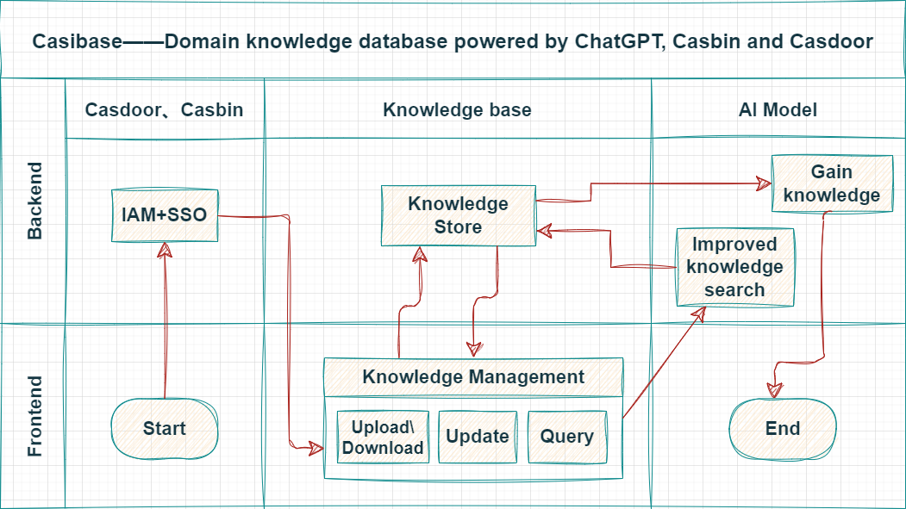
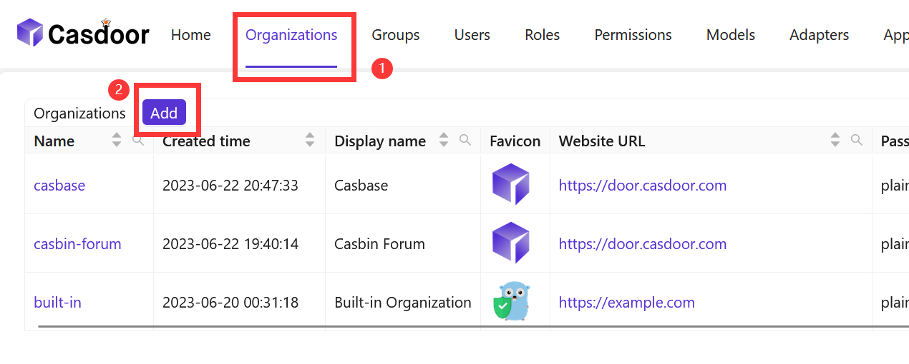
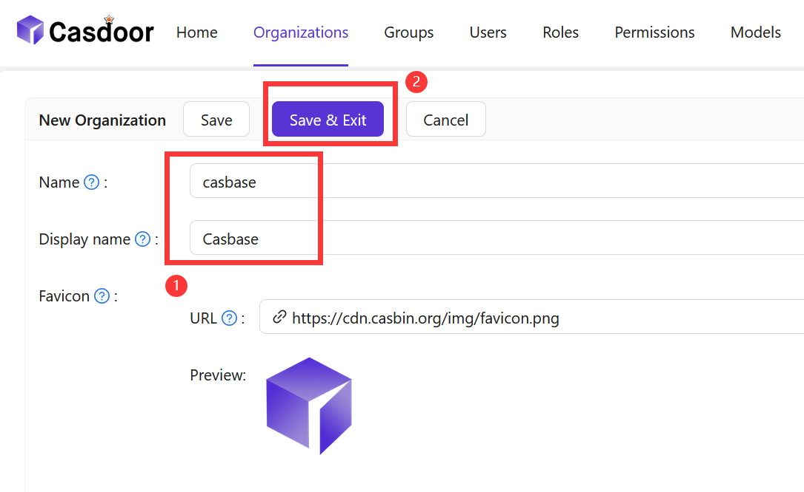
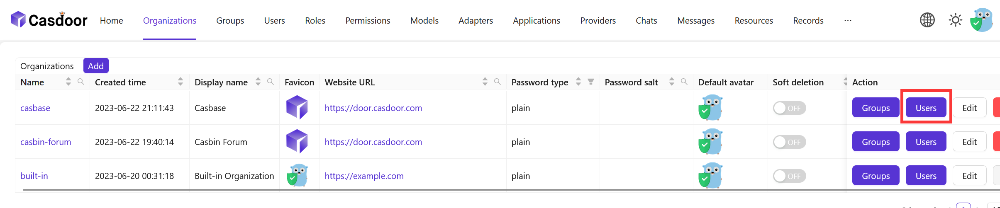
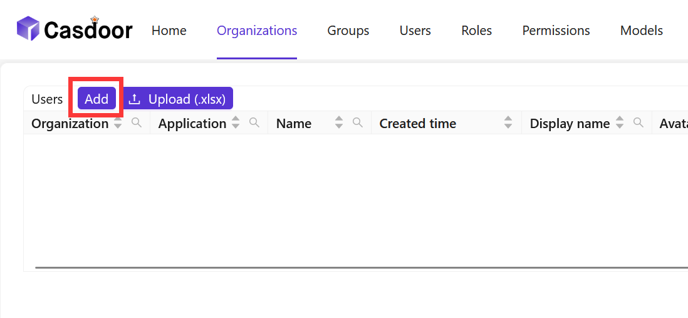
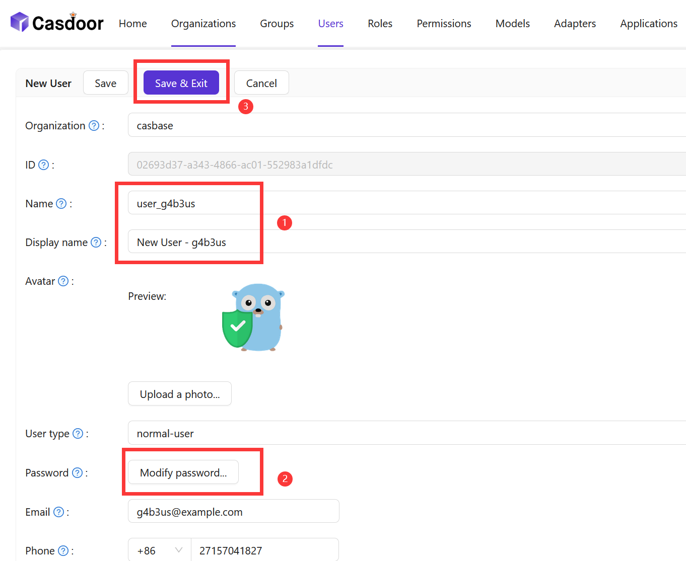
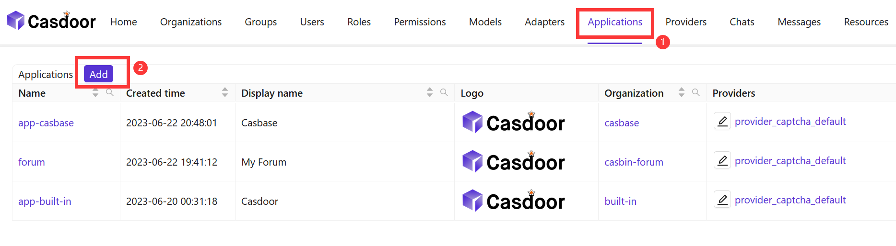
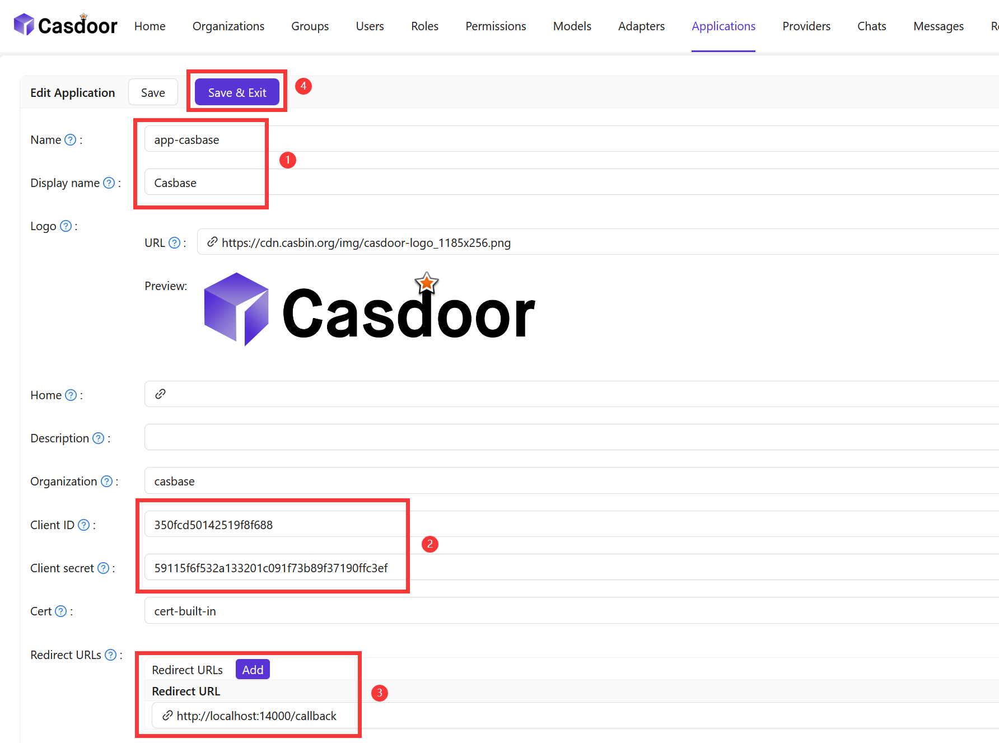
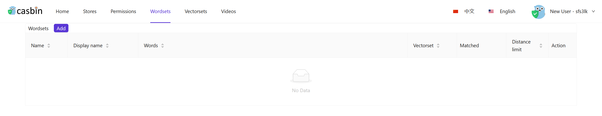
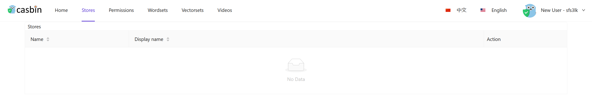

<h1 align="center" style="border-bottom: none;">📦⚡️ Casibase</h1>
<h3 align="center">A pioneering customizable open-source Domain Knowledge Base (DKB)
    powered by ChatGPT, Casbin, and Casdoor.</h3>
<p align="center">
  <a href="#badge">
    
  </a>
  <a href="https://hub.docker.com/r/casbin/casibase">
    
  </a>
  <a href="https://github.com/casbin/casibase/actions/workflows/build.yml">
    
  </a>
  <a href="https://github.com/casibase/casibase/releases/latest">
    
  </a>
  <a href="https://hub.docker.com/repository/docker/casbin/casibase">
    
  </a>
<!-- waiting for changing -->
<!-- <a href="https://hub.docker.com/r/casbin/casibase"> -->
<!-- <a href="https://github.com/casbin/casibase/actions/workflows/build.yml"> -->
<!-- <a href="https://github.com/casibase/casibase/releases/latest"> -->
<!-- <a href="https://hub.docker.com/repository/docker/casbin/casibase"> -->
</p>

<p align="center">
  <a href="https://goreportcard.com/report/github.com/casbin/casibase">
    
  </a>
  <a href="https://github.com/casbin/casibase/blob/master/LICENSE">
    
  </a>
  <a href="https://github.com/casbin/casibase/issues">
    
  </a>
  <a href="#">
    
  </a>
  <a href="https://github.com/casbin/casibase/network">
    
  </a>
  <a href="https://crowdin.com/project/casibase-site">
    
  </a>
  <a href="https://gitter.im/casbin/casibase">
    
  </a>
<!-- waiting for changing -->
<!-- <a href="https://goreportcard.com/report/github.com/casbin/casibase"> -->
<!-- <a href="https://crowdin.com/project/casibase-site"> -->
<!-- <a href="https://gitter.im/casbin/casibase"> -->
</p>

## Architecture

casibase contains 4 parts:

| **Name**       | **Description**                                   | **Language**                            |
| -------------- | ------------------------------------------------- | --------------------------------------- |
| Frontend       | User interface for the casibase application       | JavaScript + React                      |
| Backend        | Server-side logic and API for casibase            | Golang + Beego + Python + Flask + MySQL |
| AI Model       | Artificial intelligence model                     | Python + OpenAI                         |
| Knowledge Base | Storage for casibase application domain knowledge | pgvector                                |



## Demo Installation

casibase uses Casdoor to manage members. So you need to create an organization and an application for casibase in a Casdoor instance.

### Casdoor configuration 

```shell
git clone https://github.com/casdoor/casdoor.git
```

refer to: https://casdoor.org/docs/basic/server-installation

Follow these steps to setup Casdoor for casibase:

- Create an **Organization**

- Configure information about the **Organization**

- Add a member to a newly created organization

- Configure member information (remember its **Name** as well as **Password**)


- Create a new **Application**

- Configuring **Application** Information (Remember **Name, ClientID** and **ClientSecret**. Change **RedirectURLs** to http://localhost:14000/callback)

### casibase configuration 

#### Get the code

```shell
git clone https://github.com/casbin/casibase.git
```

#### Setup database

casibase will store its users, nodes and topics informations in a MySQL database named: `casibase`, will create it if not existed. The DB connection string can be specified at: https://github.com/casbin/casibase/blob/master/conf/app.conf

```ini
dataSourceName = root:123@tcp(localhost:3306)/
```

Casnode uses XORM to connect to DB, so all DBs supported by XORM can also be used.

#### Custom config

- #### Backend (`casibase\conf\app.conf`)

  ```ini
  clientId = <Your_clientId_in_Casdoor_configuration>
  clientSecret = <Your_clientSecret_in_Casdoor_configuration>
  casdoorDbName = casdoor
  casdoorOrganization = "casibase"
  casdoorApplication = "app-casibase"
  ```

- #### Frontend (`casibase\web\src\Conf.js`)

  ```ini
  export const AuthConfig = {
    ......
    clientId: <Your_clientId_in_Casdoor_configuration>,
    ......
  };
  ```

#### Run casnode

  - #### Backend (`casibase`)

    ```shell
    go run main.go
    ```

  - #### Frontend (`casibase\web`)

    ```shell
    yarn install
    yarn start
    ```

#### Preview

Access the login view via the following link:

```shell
http://localhost:13001
```





The **casibase** demo is shown above, and in the future users can upload various **knowledge** files, **wordsets**, and **vectorsets** to achieve a **customized domain knowledge base**.